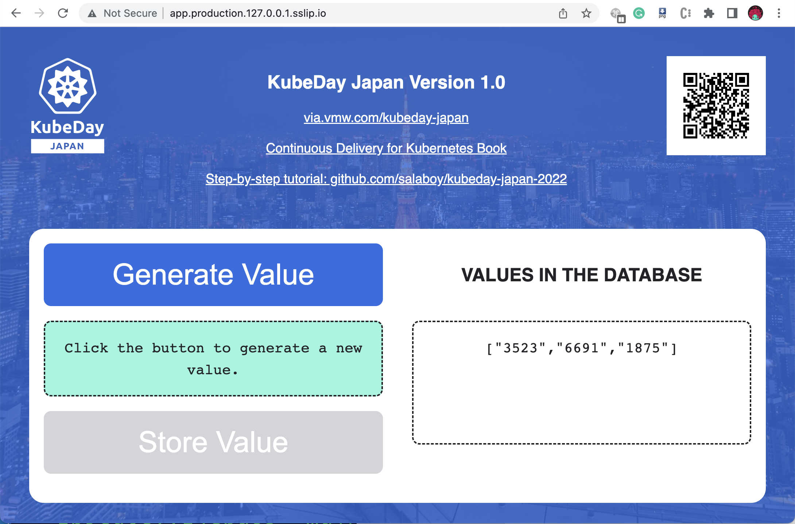

# Kubeday Japan Demo :: Step-by-step tutorial 

On this step-by-step tutorial we are going to setup up and use a Function-as-a-Service (FaaS) platform. Development teams can request their development environments, create and deploy their functions that can be later promoted to our production environment using a GitOps approach. 

After setting up all the tools that we need, this tutorial is divided into three main sections: 

- [Requesting a New Environment (FaaS Enabled)](#requesting-a-new-environment)
- [Creating and Deploying a Function without writing Dockerfiles or YAML files](#requesting-a-new-environment)
- [Our Function Goes to Production using GitOps](#our-function-goes-to-production)

> But before you jump into the demos, you need to make sure that you follow the [Prerequisites and Installation Guide](prerequisites.md). The pre-requisites and installation guide has also some useful information about the tools that have been used to create this demo.

After you followed the installation instruction you should be able to point your browser to [http://app.production.127.0.0.1.sslip.io](http://app.production.127.0.0.1.sslip.io) and access the production version of the application.




## Requesting a New Environment 

(Make sure that you are connected to our Platform Cluster that we configured in [Prerequisites and Installation Guide](prerequisites.md))


To request a new `Environment` using our Platfrom API, you need to create a new `Environment` resource like this one: 

```team-a-env.yaml
apiVersion: salaboy.com/v1alpha1
kind: Environment
metadata:
  name: team-a-env
spec:
  compositionSelector:
    matchLabels:
      type: development
  parameters: 
    database: true
    
```

Next, send it to the Platform APIs using `kubectl`:

```
kubectl apply -f team-a-env.yaml
```

You should see something like this: 
```
environment.salaboy.com/team-a-env created
```

You can now treat your created `Environment` resource as any other Kubernetes resource. You can list them using `kubectl get environments`, or even `kubectl describe` them to see more details. 

```
kubectl get environments
NAME         DB     SYNCED   READY   COMPOSITION           AGE
team-a-env   true   True     False   devenvs.salaboy.com   4s
```

Before connecting to the environment you need to wait for it to be fully provisioned `(`READY = True`).

Depending on which tools the platform is using to provision the environment you will have different mechanism to connect to it. For this demo, we are using [VCluster](https://vcluster.com)
hence we will run the following command to connect to it when it is ready:

On Linux with `bash`:
```
vcluster connect team-a-env --server https://localhost:8443 -- bash
```
or on Mac OSX with `zsh`:

```
vcluster connect team-a-env --server https://localhost:8443 -- zsh
```

We just used VCluster to connect to our `Environment`, therefor now we can use `kubectl` as usual (try `kubectl get namespaces` to check that you are in a different cluster). But instead of using `kubectl`. (you try `kubectl get nodes` to see that you are connected to a different cluster)

Once you are connected, you can run the following command to obtain the application running inside our freshly development environment:

```
kubectl get ksvc
```
You should see the following output: 

```
NAME   URL                                                                   LATESTCREATED                      LATESTREADY                        READY   REASON
app    http://app-x-default-x-team-a-env.team-a-env.127.0.0.1.sslip.io   app-x-default-x-team-a-env-00001   app-x-default-x-team-a-env-00001   True    

```

If you point your browser to [http://app-x-default-x-team-a-env.team-a-env.127.0.0.1.sslip.io](http://app-x-default-x-team-a-env.team-a-env.127.0.0.1.sslip.io) you can use the application inside your development environment. Try it by generating some values and check that the values are stored in the database.


We can now create a function and deploy it to our freshly created **Development Environment**.

## Creating and Deploying a Function

Now that we have an environment let's create and deploy a function to it. We want to create a function that connects to the Redis database and calculate the average of all the values stored.

First let's create a new empty directory for the function:

```
mkdir functions/avg/
cd functions/avg/
```

Now we can use `func create` to scaffold a function using the `Go` programming language and a template called `redis` that was defined inside the template repository [https://github.com/salaboy/func](https://github.com/salaboy/func)
```
func create -r https://github.com/salaboy/func -l go -t redis
```

Feel free to open the function using your favourite IDE or editor. You need to change the template to calculate the average. 

We need to make sure that the function can connect to our database, hence we need to add a new environment variable with the `REDIS_PASSWORD` and `REDIS_HOST`.

```
func config envs add --name=REDIS_HOST --value='kubeday-japan-app-redis-master:6379'
func config envs add --name=REDIS_PASSWORD --value='{{ secret:kubeday-japan-app-redis:redis-password }}'
```

We can deploy this function to our development environment by running: 

```
func deploy -v --registry docker.io/<YOUR DOCKERHUB USER>
```

Where the `--registry` flag is used to specify where to publish our container image. This is required to make sure that the target cluster can access the function's container image.

Before the command ends, it gives us the URL of where the function is running. Now we use `curl` to calculate the average of the values that are stored in our development environment: 

```
curl http://avg-x-default-x-team-a-env.team-a-env.127.0.0.1.sslip.io
```


You have just created and deployed a function to the `team-a-env` envrionment!
This function is connecting to the Redis database in our development environment and calculating the average of all the numbers that are stored there, but how do we promote this function to our production environment?  


## Our Function Goes to Production

When we want to promote new applications, services or functions into our production environment(s) we cannot use the same tools that we are using for our development activities. First, we don't want to access and modify the configuration of our Production clusters manually, as keeping track of what changed is hard. Secondly, the platform should pave the way for our development changes to reach the production environment in a safe manner. 


To achieve this, the platform team is using a GitOps approach to configure what is deployed to production. This means that a Git repository is used to host the configuration of our Production Environment. This allow the platform team to quickly replicate these configurations in different clusters and geographical regions if needed. 

The repository used for this demo can be found here: [KubeDay Japan Production](https://github.com/salaboy/kubeday-japan-production/). If you are running this demo, it is recommended for you to fork this repository or create your own repository to host your production configurations.

This repository contains the configurations used to run our Monolith Application, you can find this inside the `production` directory. 

This configuration is synced (maybe automatically) with a live cluster, removing the need for operators / admins to connect directly with the cluster. 

This approach enable teams in charge of keeping the production environment safe to apply changes by only modifying the configuration files located in this repository. If something goes wrong they can revert back to a stable state by reverting commits in the repository. 

To deploy the function that we have just created to our production environment, we send a pull request to our production environment [GitHub repository](https://github.com/salaboy/kubeday-japan-production). This pull request contains the configuration required to deploy our new function to the production environment. 
 
By sending a Pull Request adding the function configurations file, we can enable automated tests on the platform to check if the changes are production-ready. Once the changes are validated, the pull request can be merged. 

[Check this example pull request that changes the configuration of the application to use our new function image](https://github.com/salaboy/kubeday-japan-production/pull/1/files). 


Once the changes are merged into the `main` branch of our repository, ArgoCD will sync these configuration changes. This causes our function to be deployed and automatically available for our users to interact with. 


If you push new configuration changes inside the `/production` directory, you can use ArgoCD to sync these changes to the production cluster, without the need of using `kubectl` to the production namespace directly. 

Once the function is synced by ArgoCD you should be able to point your browser to [https://avg.production.127.0.0.1.sslip.io/](https://avg.production.127.0.0.1.sslip.io/) to see the new version of the application up and running! 

**Our change made it to production!**

If you want to now update the Application to consume the function that we have deployed, you will need another PR changing the app.yaml file to use the following container `image: salaboy/app-c863bf8a26a07de0524697b6de429c8c@sha256:5b2ceca7cfe5f2ed875d595d9ad4b874c5cdc4518d54a94028ca673a3b2a0f36`. Now every time that a new value is stored into the database, a call to `AVG function` will include all the stored values. 


# Resources and Links

- [Continuous Delivery for Kubernetes - Manning 2022](http://mng.bz/jjKP)
- [salaboy.com](https://salaboy.com):
  - **The Challenges of Building Platforms**: 
    - [1/4 Introduction and challenges](https://salaboy.com/2022/09/29/the-challenges-of-platform-building-on-top-of-kubernetes-1-4/)
    - [2/4 Platform topologies, multi-cluster and virtual clusters](https://salaboy.com/2022/10/03/the-challenges-of-platform-building-on-top-of-kubernetes-2-4/)
    - [3/4 Extending Kubernetes and higher level abstractions](https://salaboy.com/2022/10/17/the-challenges-of-platform-building-on-top-of-kubernetes-3-4/)
    - [4/4 Tailored Developer Experiences enabled by the platform]()
  - [Crossplane in 2022](https://salaboy.com/2022/08/30/my-thoughts-about-crossplane-in-2022/)
  - [Using Crossplane and VCluster together to build platforms](https://salaboy.com/2022/08/03/building-platforms-on-top-of-kubernetes-vcluster-and-crossplane/)
- **KubeCon NA Keynote**
  - [Blog Post + Video Recording](https://salaboy.com/2022/10/31/kubecon-na-knativecon-na-2022/)
  - [Demo / Step by step tutorial](https://github.com/salaboy/kubecon-na-keynote)  

