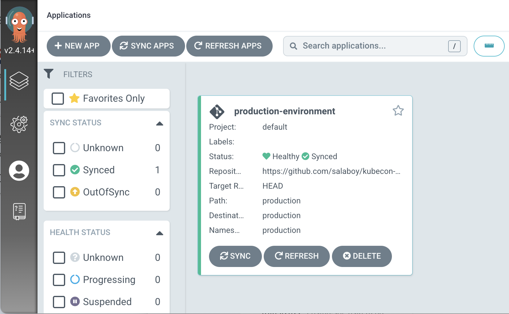
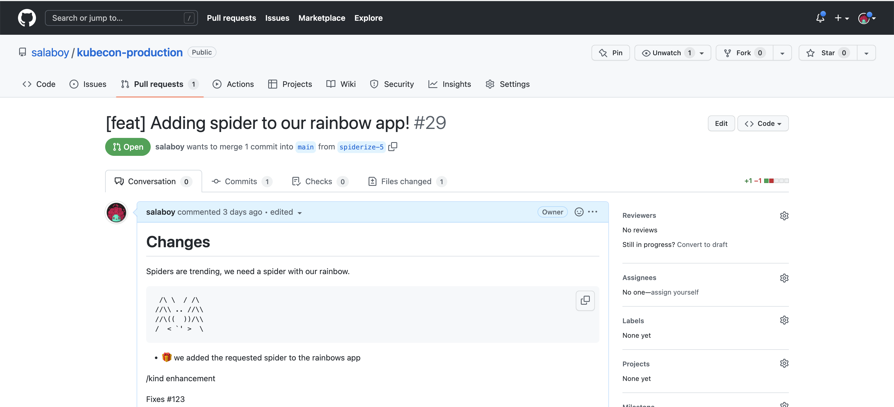
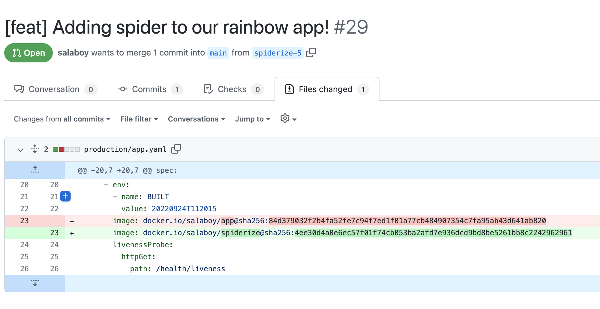

# Kubeday Japan Demo :: Step-by-step tutorial 

On this step-by-step tutorial we are going to setup up and use a Function-as-a-Service (FaaS) platform that development teams can use to request their development environments, create and deploy their functions that can be later promoted to production our production environment. 

After setting up all the tools that we need, this tutorial is divided into three main sections: 
- Requesting new Development Environments (FaaS Enabled)
- Creating and deploying functions without writing Dockerfiles or YAML files
- Promoting our function to our production environment

This step-by-step tutorial is divided into 3 sections:
- [Requesting a New Environment](#requesting-a-new-environment)
- [Creating and Deploying a Function](#requesting-a-new-environment)
- [Our Function Goes to Production](#our-function-goes-to-production)

> But before you jump into the demos, you need to make sure that you follow the [Prerequisites and Installation Guide](prerequisites.md).

## Requesting a New Environment 

To use the platform to request a new `Environment`, you need to create a new `Environment` resource like this one: 

```team-a-env.yaml
apiVersion: salaboy.com/v1alpha1
kind: Environment
metadata:
  name: team-a-env
spec:
  compositionSelector:
    matchLabels:
      type: development
  parameters: 
    database: true
    
```

Next, send it to the Platform APIs using `kubectl`:

```
kubectl apply -f team-a-env.yaml
```

You can now treat your created `Environment` resource as any other Kubernetes resource. You can list them using `kubectl get environments`, or even `kubectl describe` them to see more details. 

Because we are using VCluster, you can go back and check if there is now a new VCluster with this command:

```
vcluster list 
```

Notice the VCluster is there, but it is not connected.


We can now create a function and deploy it to our freshly created **Development Environment**.

## Creating and Deploying a Function

Now that we have an environment let's create and deploy a function to it.

Before creating a function, let's make sure that we are connected to our **Team A Environment**: 

On Linux with `bash`:
```
vcluster connect team-a-env --server https://localhost:8443 -- bash
```
or on Mac OSX with `zsh`:

```
vcluster connect team-a-env --server https://localhost:8443 -- zsh
```

We just used VCluster to connect to our `Environment`, therefor now we can use `kubectl` as usual (try `kubectl get namespaces` to check that you are in a different cluster). But instead of using `kubectl`, we will use the [Knative Functions](https://github.com/knative/func) CLI to enable our developers to create functions without the need of writing Dockerfiles or YAML files. 

First let's create a new empty directory for the function:
```
mkdir functions/avg/
cd functions/avg/
```
Now we can use `func create` to scaffold a function using the `Go` programming language and a template called `redis` that was defined inside the template repository [https://github.com/salaboy/func](https://github.com/salaboy/func)
```
func create -r https://github.com/salaboy/func -l go -t redis
```

Feel free to open the function using your favourite IDE or editor.

We need to make sure that the function can connect to our database, hence we need to add a new environment variable with the REDIS_PASSWORD and REDIS_HOST.

```
func config envs add --name=REDIS_HOST --value='kubeday-japan-app-redis-master:6379'
func config envs add --name=REDIS_PASSWORD --value='{{ secret:kubeday-japan-app-redis:redis-password }}'
```

We can deploy this function to our development environment by running: 

```
func deploy -v --registry docker.io/<YOUR DOCKERHUB USER>
```

Where the `--registry` flag is used to specify where to publish our container image. This is required to make sure that the target cluster can access the function's container image.

Before the command ends, it gives us the URL of where the function is running. Now we can copy the URL and open it in our browser. It should look like this: 

[http://avg-x-default-x-team-a-env.team-a-env.127.0.0.1.sslip.io](http://avg-x-default-x-team-a-env.team-a-env.127.0.0.1.sslip.io)


Voila! You have just created and deployed a function to the `team-a-env` envrionment. 


## Our Function Goes to Production

We have configured the production cluster to use [ArgoCD to synchronize the configuration located into a GitHub repository to our production namespace](https://github.com/salaboy/kubeday-japan-2022/blob/main/platform-cluster.md#configure-production-environment-namespace). 



To deploy the function that we have just created to our production environment, we send a pull request to our production environment [GitHub repository](https://github.com/salaboy/kubeday-japan-production). This pull request contains the configuration required to deploy our new function to the production environment. 
 
By sending a pull request adding the function configurations file, we can enable automated tests on the platform to check if the changes are production-ready. Once the changes are validated, the pull request can be merged. 

[Check this example pull request that changes the configuration of the application to use our new function image](https://github.com/salaboy/kubeday-japan-production/pull/1/files). 



Once the changes are merged into the `main` branch of our repository, ArgoCD will sync these configuration changes. This causes our function to be deployed and automatically available for our users to interact with. 



We have used the following repository to host our production environment configuration: 
[https://github.com/salaboy/kubeday-japan-production](https://github.com/salaboy/kubeday-japan-production)

We recommend that you fork this repository, or create a new one and copy the contents. 

If you push new configuration changes inside the `/production` directory, you can use ArgoCD to sync these changes to the production cluster, without the need of using `kubectl` to the production namespace directly. 

Once the function is synced by ArgoCD you should be able to point your browser to [https://avg.production.127.0.0.1.sslip.io/](https://avg.production.127.0.0.1.sslip.io/) to see the new version of the application up and running! 

**Our change made it to production!**

If you want to now update the Application to consume the function that we have deployed, you will need another PR changing the app.yaml file to use the following container `image: salaboy/app:v2-with-avg`. Now every time that a new value is stored into the database, the AVG function is called and the user interface display the results each time. 

# Resources and Links

- [Continuous Delivery for Kubernetes - Manning 2022](http://mng.bz/jjKP)
- [salaboy.com](https://salaboy.com):
  - **The Challenges of Building Platforms**: 
    - [1/4 Introduction and challenges](https://salaboy.com/2022/09/29/the-challenges-of-platform-building-on-top-of-kubernetes-1-4/)
    - [2/4 Platform topologies, multi-cluster and virtual clusters](https://salaboy.com/2022/10/03/the-challenges-of-platform-building-on-top-of-kubernetes-2-4/)
    - [3/4 Extending Kubernetes and higher level abstractions](https://salaboy.com/2022/10/17/the-challenges-of-platform-building-on-top-of-kubernetes-3-4/)
    - [4/4 Tailored Developer Experiences enabled by the platform]()
  - [Crossplane in 2022](https://salaboy.com/2022/08/30/my-thoughts-about-crossplane-in-2022/)
  - [Using Crossplane and VCluster together to build platforms](https://salaboy.com/2022/08/03/building-platforms-on-top-of-kubernetes-vcluster-and-crossplane/)
- **KubeCon NA Keynote**
  - [Blog Post + Video Recording](https://salaboy.com/2022/10/31/kubecon-na-knativecon-na-2022/)
  - [Demo / Step by step tutorial](https://github.com/salaboy/kubecon-na-keynote)  

